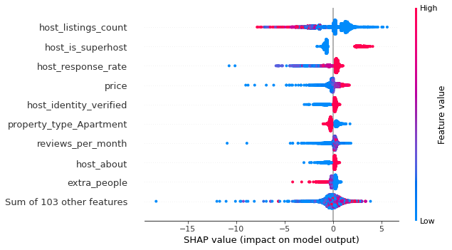
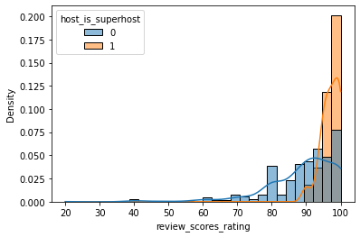
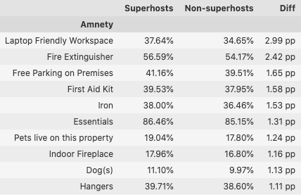
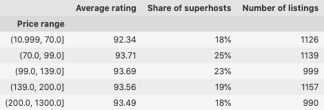
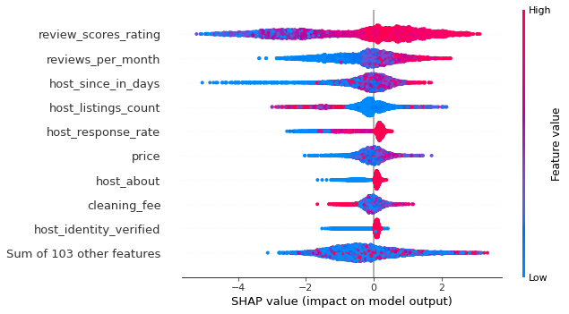

# Do you want to become an AirBnB superhost?
## What separates regular hosts from superhosts

![photo of airbnb host Yoshiko][hosts]

Kaggle provides public datasets from Airbnb for [Boston](https://www.kaggle.com/datasets/airbnb/boston) and [Seattle](https://www.kaggle.com/datasets/airbnb/seattle) These datasets contain information about

* Listings, including full descriptions and average review score
* Reviews, including unique id for each reviewer and detailed comments
* Calendar, including listing id and the price and availability for that day

In this article we will take a closer look at the the listings data.

1. What influences average review scores?
1. Superhost and hosts: In what way are they different?
  * Do their review scores differ?
  * Which amneties are offered?
  * Are superhosts super-expensive?
3. What influences the superhost staus?

The datasets have a good quality, but of course some preparations were necessary to work with the data.

## What influences average review scores?
In addition to written reviews guests can rate their stay in different categories. More information about this can be found [here](https://www.airbnb.com/help/article/1257/star-ratings). To answer the question what influences average review scores, a machine learnig model has been trained to compute the review score based on the features from the listings files. The most important features in the model and their influence on the model's result are depicted in the picture below. 

The most relevant features in the model were:
1. host_listings_count
1. host_is_superhost
1. host_response_rate
1. price 

High number of listings tend to decrease the review score while hosts with a high response rate usually receive better review scores ratings. Some cheap listings had a negative effect on the their review score. Of special interest for us is the second feature 'host_is_superhost'. According to AirBnB superhosts are:

> "Anyone who’s extremely welcoming and experienced at making guests feel like they belong, or anyone who can conjure up an extraordinary Airbnb Experience can become a Superhost.
> No need to apply—you simply earn Superhost status by **doing things like receiving positive reviews, being responsive, and avoiding cancellations** where possible."  

We will have a closer look at these superhosts in the following section.

## Superhosts and hosts: In what way are they different?
AirBnB states that one element of becoming a superhost are positive reviews. Positive reviews should lead to good review scores. The following histogram  clearly supports that connection. The review score ratings in general have a quite wide range, but those of superhosts are concentrated in the range from 90 to 100.

Also amneties offered by the hosts are part of the dataset. Therefore it is possible to make a comparison between amneties offered by superhost and non-superhosts. The table below shows the amneties that are offered more often by superhosts than non-superhosts.

Laptop friendly workspaces are the amnety with the largest difference between superhosts and non-superhosts. They are offered in 37.64%	of superhost listings and in 34.65%	of the non-superhost listings.

Apart from amneties the prices for offers by superhosts could be different. At least one could expect that when the attribute 'super' is used for these hosts. To check that, all the listings were put into five groups according to their price. 

The price ranges group the listings in bins of a roughly equal size. We can see that in each group the average rating is close to 93%. The share of superhosts is always between 18 and 25 percent. So the superhost status does not mean that the prices are exceptionally high. Offers by superhosts can be found in the complete price range.

In the last section we will have a look at the superhost status.

## What influences the superhost staus?
Airbnb claims that the superhost status can be reached by receiving positive reviews, being responsive, and avoiding cancellations. To verify that a second machine learning model has been created. This model learned to decide whether a listing is by a superhost or not. If AirBnB's claim is true, the features with the highest influence in the model should fit to their explaination of the superhost status.

According to the model the superhost status is achievable by high review scores ratings, a good response rate and by a high number of reviews per month. Of course you need to be a host for some time to become a superhost. We can see that the relevant features indeed fit to AirBnB's explaination very well.

To sum up, we have learned that among other things it needs good ratings and to be responsive to receive the superhost status - as AirBnB states on their website. Next to some amneties good ratings are the stuff that separate superhosts from usual hosts. Superhost offers can be found in the full price range, i.e. superhost does not mean super expensive.

And now it's your turn to find out more interesting things about AirBnB...

[hosts]: hosts.jpg "airbnb host Yoshiko https://www.flickr.com/photos/tobin/14188971889 Attribution-ShareAlike 2.0 Generic (CC BY-SA 2.0)"
